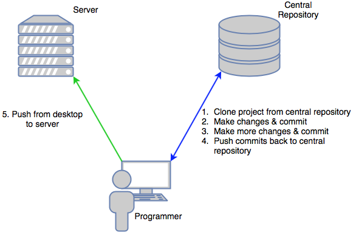
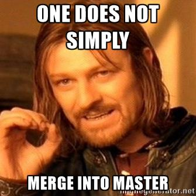
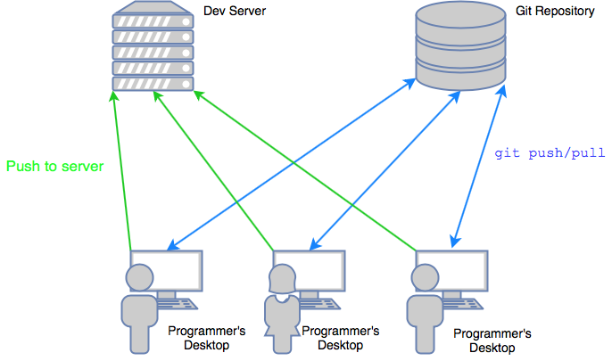
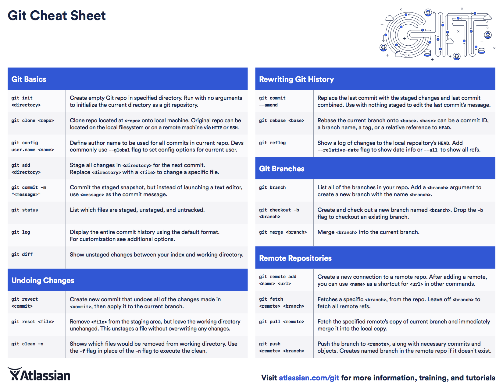

Git Manual
==========

This manual should help get you up to speed on how to use Git at Student Life Technology. If you are new to Git, it is highly recommended that you take 15 minutes right now and do the official Git tutorial [here](https://try.github.io/levels/1/challenges/1). Read through the tutorial on [this web site](https://www.atlassian.com/git/tutorials/what-is-version-control) as well, at least the "Beginner" section and the "Getting Started" sections.

We use the [feature branch workflow](https://www.atlassian.com/git/tutorials/comparing-workflows#feature-branch-workflow). Go read up on how these work.

Basic Concepts
--------------

A *repository* (or *repo* for short) is sort of like a storage space for a single project. Each web site at SLT will have its own separate repository. All the repositories are stored on the same server. (TODO: add server name here)

We have some servers intended for code development, which are accessible only from within the office (e.g. `pegleg`) and some which are accessible to everyone. (e.g. `thunderbolt`) These are called `production` and `development` servers respectively. Our central repository lives on neither kind of server.

The Git repository acts as the definitive definition of the source code. If you change something directly on one of the servers, you have just committed a **GRIEVOUS SIN**!! When we need to add/modify code, we clone the site onto our desktop machine, make the changes, commit our changes, then push from our desktop to the server.

Git repositories have multiple *branches*. A branch is like a lightweight copy of the project. There is always a branch called `master`. You can create your own branches (which you should) to work on your changes. This allows you to work without disturbing other people's changes.

Command Summary
---------------

 - `git help [command]`
 
	 If you are ever unsure about a Git command, use `git help`. (E.g. `git help log` for help on `git log`.)

 - `git status`

	 Check the status of the repository. See also what files have changed and are ready to be committed.

 - `git log`

	 See the log of merges.

 - `git diff [commit1] [commit2]`

	 See a list of changes between two commits.

 - `git clone [repo]`

	 Clone a repository.

 - `git add [file1] [file2] ...`

	 Add changed files to staging area. (Prepare for commit.)

 - `git commit [-m "<message here>"]`

	 Commit changes added to the staging area with `git add`. If you do not specify a message with the `-m` flag, it will open up a text editor (usually vim or nano, but can be configured to open with emacs (and maybe sublime?)) and prompt you for a message.

 - `git pull [location] [branchname]`

	 Pull changes from `location` on branch `[branchname]`. Default is `origin`. Default branch is the current branch.

 - `git push`

	 Push changes on current branch to repository. You can change where this pushes to. See `git help push`.

 - `git merge [branchname]`

	 Merge changes on `branchname` into current branch.

 - `git branch`

	 Manage branches. With no arguments it shows you what branch you are on and what branches you have on the current repository.

 - `git checkout [-b <new_branch_name>] [existing_branch]`

	 Either switch to an existing branch like `git checkout existing_branch` or create a new branch like `git checkout -b new_branch` and switch to it.

Desktop Setup
-------------

This is how to configure your desktop computer so everything works smoothly:

1. Make sure you have Git installed.

2. Make a place for your repos to live.
    Use a folder called `Projects/` on your desktop machine.

3. Setup user name and email.
	Do this so we know who committed what. You can set the user name and password like this: (you don't have to be in a particular folder)
	
		desktop:~ $ git config --global user.name "Your Name"
		desktop:~ $ git config --global user.email "youremail@provider.com"

*You should only ever have to do that once.* Once you're setup, do the following to get setup with a web site:

1. Clone the site.

		desktop:~ $ cd Projects/
		desktop:Projects $ git clone programmer@sltrepo.byu.edu:repos/new_site/

2. Create your own branch.
	Do this to keep your changes isolated from everyone else's changes. Give it a descriptive name, starting with your name:
	
		desktop:new_site $ git branch ashton_new_instructions
		desktop:new_site $ git checkout ashton_new_instructions

Happy hacking!

Practices
---------

 - Do you work in your own topic branch.
	 This is so you can push your changes to the central repository without breaking `master`.
 - At the end of every day, **COMMIT AND PUSH YOUR CODE!!**
     We don't have backups of the desktop machines. Push your topic branch, **NOT** `master`.
 - Commit often.
     Even if all you've done is added a few lines of code, commit. You should be committing code multiple times a day. You don't necessarily have to push.
 - Keep branch `master` clean.
	 Don't merge into `master` unless you have had your code reviewed, and are sure it is bug-free. We want to keep `master` deployable at all times.
 - Commit often. Push at the end of the day.
     Yes, it's worth repeating.

Creating a New Web site
----------------------

1. Go to the central repository.

	Pretend our repository is stored under the home directory of `sltrepo.byu.edu`.
	
		desktop:~ $ ssh programmer@sltrepo.byu.edu
		sltrepo:~ $ cd repos/

2. Create a new folder.

		sltrepo:repos $ mkdir my_new_site
		sltrepo:repos $ cd my_new_site/

3. Run `git init --bare` to build the site's repository.

		sltrepo:repos/my_new_site $ git init --bare

4. Go to your desktop and clone.

		desktop:~ $ cd Projects/
		desktop:Projects $ git clone programmer@sltrepo.byu.edu:repos/my_new_site/

5. Make a build script.

	A build script is a program meant to automate copying your code from your desktop to the server. See [this section][Build scripts and deploying code] for more information.


Workflow
--------

#### Solo Development/Fixing an old project ####



1. Clone the source from the central repository.

		desktop:Projects $ git clone programmer@sltrepo.byu.edu:repos/my_site

2. Create a topic branch.

		desktop:my_site $ git checkout -b bug-#042 master
	
	This creates a new branch called `bug-#042` (give it a good name) based off of the `master` branch.

3. Make changes and commit.

		desktop:my_site $ emacs index.php
		(...)
		desktop:my_site $ git add index.php
		desktop:my_site $ git commit -m "changed some stuff in index.php"

4. Make more changes and commit.

		desktop:my_site $ emacs index.php
		(...)
		desktop:my_site $ emacs foo.html
		(...)
		desktop:my_site $ git add index.php foo.html
		desktop:my_site $ git commit -m "made index.php pull in cool stuff from foo.html"

5. Push your topic branch.

		desktop:my_site $ git push

	On your first push to the main repository, you will need to tell Git where to push to. Just do this:
	
		desktop:my_site $ git push --set-upstream origin bug-#042
		
	(Replace `bug-#042` with the name of your topic branch.)
	
6. Repeat steps 3--4.

7. When you are ready to push to production, have someone review your changes.

	Always have someone review your code before you merge into `master`:
	
	

	Send someone a message in Slack or just call them over to look at your changes before you merge into `master`. This way we can keep branch `master` clean, and always ready to deploy.

8. Pull changes from central repository **BEFORE** you try pushing!!

		desktop:my_site $ git checkout master
		desktop:my_site $ git pull

9. Merge and fix any problems. Commit once changes are complete.

		desktop:my_site $ git merge

		(fix merge conflicts, if any)

		desktop:my_site $ git commit -m "<merge message here>"

10. Push changes to central repository.

		desktop:my_site $ git push

#### Collaboration ####



Each programmer should have their own development branch for active development. Make sure your name is in the branch so we know who is working on what. For example, if Arthur and Ashton were to be working on the same project, they would do this:

(Ashton's side)

    ashton:my_site $ git clone programmer@sltrepo.byu.edu:repos/supplytracker/
        Cloning into 'supplytracker'...
        remote: Counting objects: 1629, done.
        remote: Compressing objects: 100% (1347/1347), done.
        remote: Total 1629 (delta 956), reused 631 (delta 229)
        Receiving objects: 100% (1629/1629), 1.68 MiB | 0 bytes/s, done.
        Resolving deltas: 100% (956/956), done.
    ashton:my_site $ cd supplytracker/
    ashton:my_site $ git branch ashton_new_feature
    ashton:my_site $ git checkout ashton_new_feature
        Switched to branch 'ashton_new_feature'

(Arthur's side)

    arthur:my_site $ git clone programmer@sltrepo.byu.edu:repos/supplytracker/
        Cloning into 'supplytracker'...
        remote: Counting objects: 1629, done.
        remote: Compressing objects: 100% (1347/1347), done.
        remote: Total 1629 (delta 956), reused 631 (delta 229)
        Receiving objects: 100% (1629/1629), 1.68 MiB | 0 bytes/s, done.
        Resolving deltas: 100% (956/956), done.
    arthur:my_site $ cd supplytracker/
    arthur:my_site $ git branch arthur_some_other_feature
    arthur:my_site $ git checkout arthur_some_other_feature
        Switched to branch 'arthur_some_other_feature'

Okay, now Ashton and Arthur each have their own branch. Now, when Ashton changes something, he can commit and push his branch to the server. Arthur can do the same.

When Arthur has finished a particular feature that Ashton wants to work with, Ashton can do something like this from *his* branch:

(Ashton's side)

	ashton:my_site $ git pull arthur_some_other_feature
	ashton:my_site $ git merge arthur_some_other_feature

At the end of the day, Arthur and Ashton should commit and push their changes:

	desktop:my_site $ git add -A
	desktop:my_site $ git commit -m "notes for tomorrow"
	desktop:my_site $ git push

These will push changes to the programmer's personal branches. As soon as they are ready to pass off a feature, they should review each other's code, then merge with `master` and push:

	desktop:my_site $ git checkout master
	desktop:my_site $ git merge arthur_some_other_feature
	desktop:my_site $ git push

#### Build scripts and deploying code ####

You can Filezilla to copy your project from your desktop to the server. However, it is better if you use some sort of build script to automate this process. If you take the time to make a good build script, we will not have to waste time later figuring out how to deploy your code to different servers. (In case we need to migrate.)

A build script can make deploying code to a server very convenient. Here's an example build script for the supply tracker/print jobs site, stored in `tracker/Makefile`:
	
```makefile
## Makefile
## Ashton Wiersdorf
## Started: Fri Jan  6 16:07:52 MST 2017

ifeq ($(MODE),production)
SERVER = thunderbolt.byu.edu
else
SERVER = ayeaye.byu.edu
endif

USER          = programmer
PWD           = /var/www/supplytracker/laravel/
EXCLUDE       = .git/ *.sqlite vendor storage .env artisan public/.htaccess database/database.db
RSYNC_OPTIONS = $(addprefix --exclude=, $(EXCLUDE)) --delete --no-p --no-t


dry-deploy:			# pretends to upload the project
	rsync -aivz --dry-run --exclude=*~ $(RSYNC_OPTIONS) . $(USER)@$(SERVER):$(PWD)

deploy:
	rsync -aivz --exclude=*~ $(RSYNC_OPTIONS) . $(USER)@$(SERVER):$(PWD)
	ssh $(USER)@$(SERVER) 'cd $(PWD); php artisan migrate:reset; php artisan migrate'
```

Here's an example of how to use:

	desktop:tracker $ make deploy
	rsync -aivz --exclude=*~ --exclude=.git/ --exclude=*.sqlite --exclude=vendor --exclude=storage --exclude=.env --exclude=artisan --exclude=public/.htaccess --exclude=database/database.db --delete --no-p --no-t . programmer@ayeaye.byu.edu:/var/www/supplytracker/laravel/
	Enter passphrase for key '/Users/programmer/.ssh/id_rsa':
	building file list ... done
	<f..T.... Makefile
	<f..T.... app/Http/Controllers/PrintJobMasterController.php
	<f..T.... doc/User_Manual.txt
	<f..T.... public/elements/print_jobs.html
	<f..T.... tests/Feature/ExtendedAPITest.php
	
	sent 436286 bytes  received 616 bytes  97089.33 bytes/sec
	total size is 91987271  speedup is 210.54

The `Makefile` (it needs to be called `Makefile` exactly) lives in the root of the project. E.g. if you were to clone the supply tracker project onto your desktop, and were to run `ls -l`, you would see something like this:

	programmer@clwc-prog-4 $ ls -lA
	total 736
	-rw-r--r--    1 programmer  staff     619 Apr 25 11:12 .env
	drwxr-xr-x   16 programmer  staff     544 Jun 12 10:44 .git
	-rw-r--r--    1 programmer  staff     141 Apr 17 15:02 .gitignore
	-rw-r--r--    1 programmer  staff    1621 Jun 12 09:47 Makefile
	-rw-r--r--    1 programmer  staff      90 Apr 14 14:49 README.txt
	...

<!-- Cheat Sheet -->
<!-- ----------- -->

<!-- Here's a nifty cheat sheet. Please see the original [here](https://www.atlassian.com/git/tutorials/atlassian-git-cheatsheet). It's lovely. -->

<!--  -->

<!--  -->
	
Further Reading
---------------

Here are some resources to help you with using Git:

 - [Comparing Workflows](https://www.atlassian.com/git/tutorials/comparing-workflows#feature-branch-workflow)

     We're using something like the "feature branch workflow". This website has some other helpful tutorials.

 - If you're new to Git, there's a lovely tutorial on Git's main page [here](https://try.github.io/levels/1/challenges/1).
